<p align="center">
  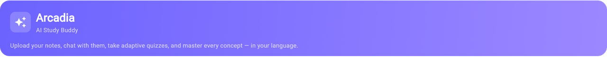
</p>

<h1 align="center">Arcadia</h1>
<p align="center">
  <b>AI-Powered Multimodal Study Buddy</b><br/>
  Upload your notes. Chat with them. Quiz yourself. Master every topic — in 9 languages.
</p>

<p align="center">
  
  
  
  
  
</p>

<p align="center">
  <a href="#features">Features</a> · 
  <a href="#demo">Demo</a> · 
  <a href="#architecture">Architecture</a> · 
  <a href="#quick-start">Quick Start</a> · 
  <a href="#api-reference">API</a> · 
  <a href="#tech-stack">Tech Stack</a> · 
  <a href="#project-structure">Structure</a>
</p>

---

## The Problem

Students drown in disorganised notes — handwritten pages, PDFs, scattered images. Existing tools don't understand **your** material. Generic AI chatbots hallucinate. Quizzes are one-size-fits-all. And almost nothing works in Indian regional languages.

## The Solution

Arcadia turns your raw notes into a **personalised learning engine:**

1. **Upload** any document (PDF, photo of handwritten notes, text file)
2. **Chat** with your notes — AI answers using only YOUR content (RAG, no hallucination)
3. **Quiz** yourself with adaptive difficulty that scales with your mastery
4. **Study** with auto-generated cheatsheets, flashcards & concept diagrams
5. **Learn in your language** — 9 languages with live TTS and instant re-translation

---

## Demo

### Screenshots

| Home & Upload | RAG Chat | Adaptive Quiz |
|:---:|:---:|:---:|
| 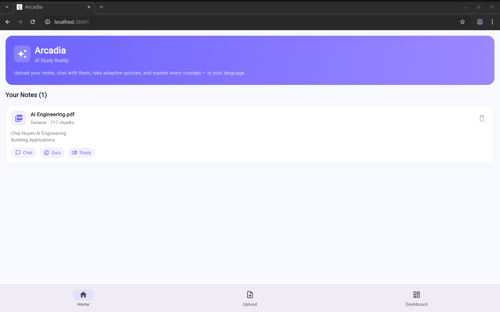 | 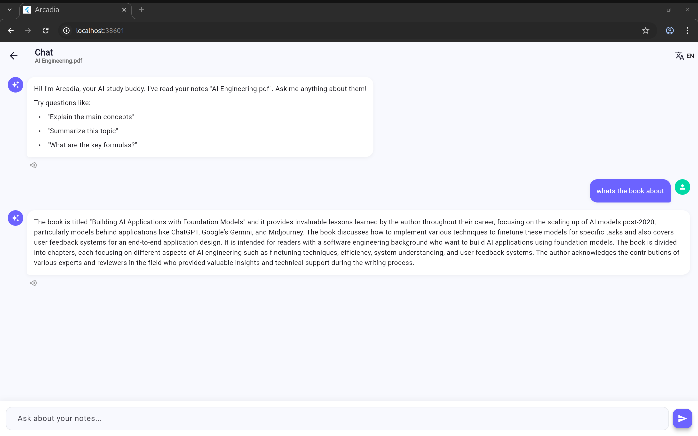 | 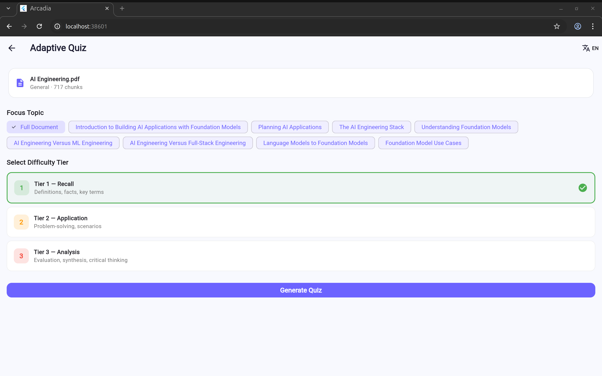 |

| Study Materials | Dashboard | Language Switch |
|:---:|:---:|:---:|
| 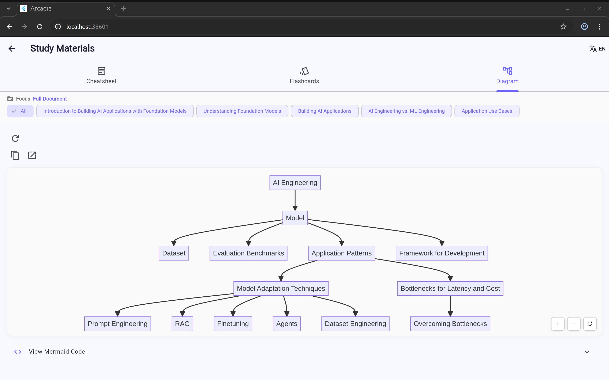 | 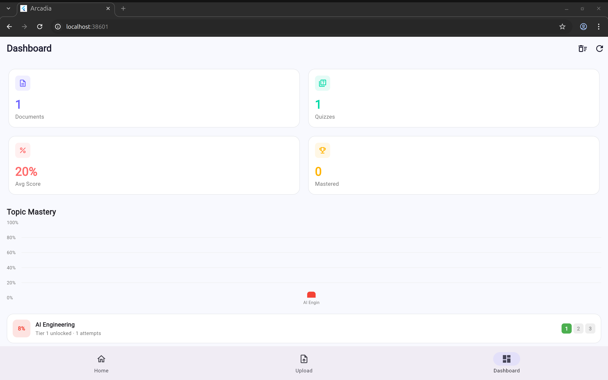 | 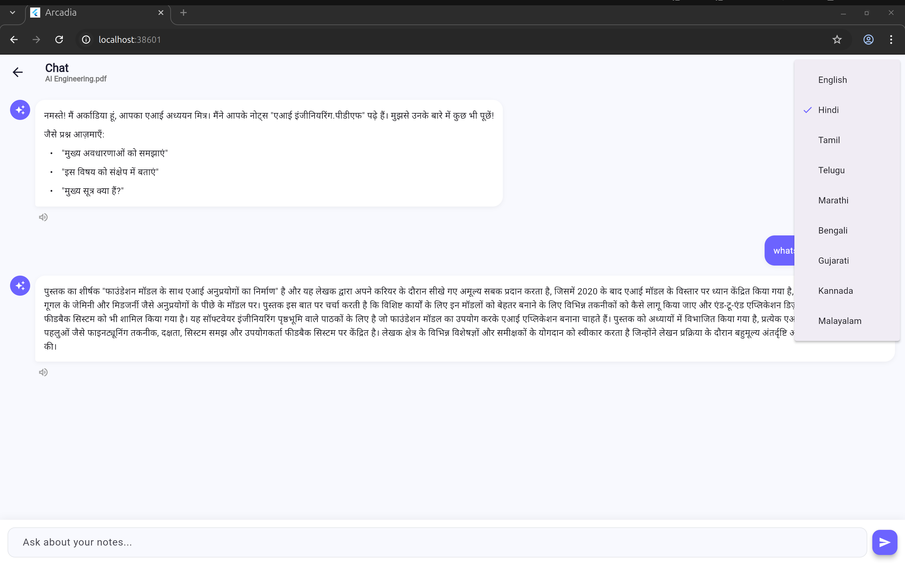 |

---

## Features

| Feature | Description |
|---------|-------------|
| **RAG-Powered Chat** | Ask questions about your uploaded notes — AI retrieves relevant chunks and answers in context, no hallucination |
| **3-Tier Adaptive Quizzes** | Recall → Application → Analysis (Bloom's Taxonomy). Tiers unlock as mastery improves |
| **Auto Cheatsheets** | One-page AI-generated summaries with key concepts, formulas & common mistakes |
| **Flashcard Decks** | Study cards generated from your uploaded material |
| **Concept Diagrams** | Mermaid.js visual flowcharts rendered live in the app |
| **9-Language Support** | English + Hindi, Tamil, Telugu, Marathi, Bengali, Gujarati, Kannada, Malayalam |
| **TTS Play/Stop Toggle** | Tap speaker to listen, tap again to stop mid-playback |
| **Live Re-translation** | Switch language and ALL existing messages re-translate instantly |
| **Mastery Dashboard** | Track scores, tier progression, and study streaks with charts |
| **Progress Reset** | One-button wipe of all quiz history, mastery scores, and chat logs |
| **OCR for Handwritten Notes** | Tesseract extracts text from photos of handwritten pages |
| **Azure-Ready** | Flip one config flag to swap from local AI to Azure OpenAI, AI Search, Cosmos DB |

---

## Architecture

<p align="center">
  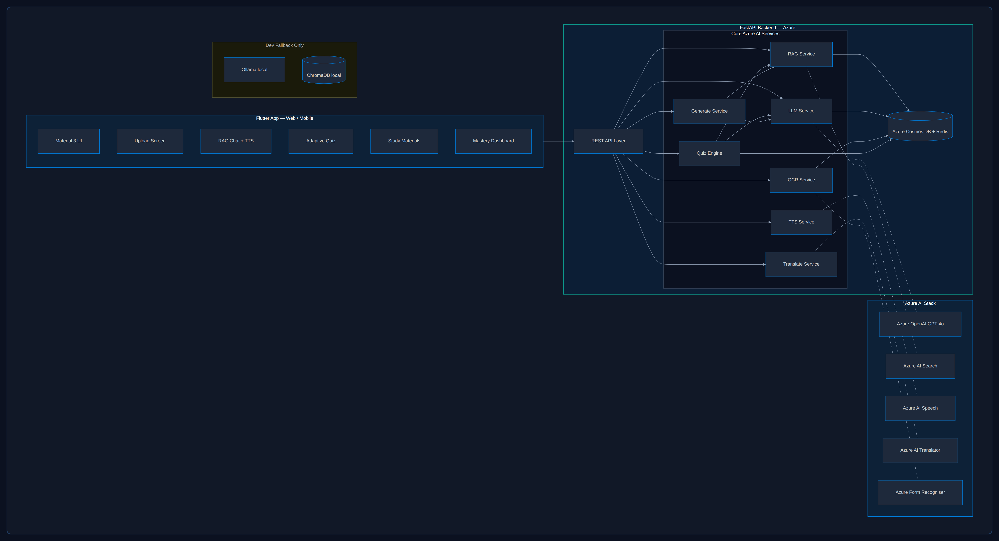
</p>

### RAG Pipeline

<p align="center">
  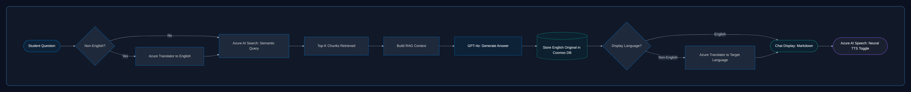
</p>

### Data Flow

<p align="center">
  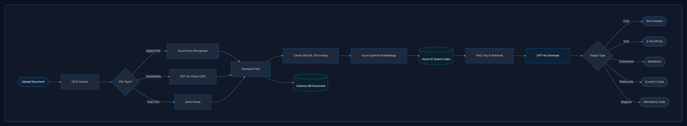
</p>

---

## Tech Stack

| Layer | Local (Default) | Azure Alternative |
|-------|----------------|-------------------|
| **LLM** | Ollama + Mistral 7B | Azure OpenAI GPT-4o |
| **Embeddings** | sentence-transformers MiniLM-L6-v2 | Azure OpenAI Embeddings |
| **Vector DB** | ChromaDB | Azure AI Search |
| **OCR** | Tesseract + pytesseract | Azure Form Recognizer |
| **TTS** | gTTS (Google) | Azure AI Speech |
| **Translation** | deep-translator (Google) | Azure AI Translator |
| **Database** | SQLite (SQLAlchemy) | Azure Cosmos DB |
| **Backend** | FastAPI (localhost:8000) | Azure App Service |
| **Frontend** | Flutter 3.x (Web/Android/iOS/Desktop) | Same |

> **To switch to Azure:** Set `MODE = "azure"` in `backend/config.py` and add your credentials. Zero frontend changes.

---

## Quick Start

### Prerequisites

```bash
# System packages (Ubuntu/Debian)
sudo apt update && sudo apt install -y tesseract-ocr poppler-utils

# Ollama (local LLM)
curl -fsSL https://ollama.com/install.sh | sh
ollama pull mistral

# Flutter — https://docs.flutter.dev/get-started/install
flutter doctor
```

### Run the Backend

```bash
cd arcadia/backend
python3 -m venv venv && source venv/bin/activate
pip install -r requirements.txt
uvicorn main:app --reload --host 0.0.0.0 --port 8000
```

Verify: `http://localhost:8000/docs` opens the Swagger playground.

### Run the Frontend

```bash
cd arcadia/frontend/arcadia_app
flutter pub get
flutter run -d chrome           # or -d linux, -d android, etc.
```

---

## API Reference

| Method | Endpoint | Description |
|--------|----------|-------------|
| `POST` | `/api/upload` | Upload PDF/image → OCR + vector indexing |
| `GET` | `/api/documents` | List all uploaded documents |
| `DELETE` | `/api/documents/{id}` | Remove a document |
| `POST` | `/api/chat` | RAG chatbot query |
| `POST` | `/api/quiz/generate` | Generate adaptive quiz for a tier |
| `POST` | `/api/quiz/submit` | Submit answers → score + mastery update |
| `POST` | `/api/generate/cheatsheet` | AI-generated one-page summary |
| `POST` | `/api/generate/flashcards` | AI-generated flashcard deck |
| `POST` | `/api/generate/diagram` | Mermaid.js concept diagram |
| `POST` | `/api/tts` | Text-to-speech (returns cached MP3 URL) |
| `POST` | `/api/translate` | Translate text between languages |
| `GET` | `/api/dashboard/stats` | Mastery scores & progress data |
| `DELETE` | `/api/dashboard/reset` | Wipe all quiz/mastery/chat history |

### Example Requests & Responses

**Chat:**
```json
// POST /api/chat
{ "document_id": "uuid", "message": "Explain F=ma", "language": "en" }

// → 200
{ "answer": "## Newton's Second Law\n...", "sources": ["chunk-uuid"] }
```

**Translate:**
```json
// POST /api/translate
{ "text": "Newton's Second Law states...", "target_language": "hi", "source_language": "en" }

// → 200
{ "translated_text": "न्यूटन का दूसरा नियम..." }
```

**TTS:**
```json
// POST /api/tts
{ "text": "Hello world", "language": "en" }

// → 200
{ "audio_url": "/static/audio/tts_abc123.mp3", "language": "en" }
```

**Reset Progress:**
```json
// DELETE /api/dashboard/reset
// → 200
{ "status": "reset_complete", "deleted": { "quiz_attempts": 5, "mastery_scores": 3, "chat_history": 42, "audio_files": 12 } }
```

---

## Project Structure

```
arcadia/
├── backend/
│   ├── config.py                 # Mode toggle (local/azure), all settings
│   ├── main.py                   # FastAPI app, CORS, startup
│   ├── requirements.txt
│   ├── models/
│   │   ├── database.py           # SQLAlchemy ORM (4 tables)
│   │   └── schemas.py            # Pydantic request/response schemas
│   ├── services/
│   │   ├── ocr_service.py        # Tesseract / PyPDF2 text extraction
│   │   ├── rag_service.py        # ChromaDB chunking, indexing, retrieval
│   │   ├── llm_service.py        # Ollama prompt templates + generation
│   │   ├── quiz_service.py       # 3-tier quiz engine + mastery scoring
│   │   ├── tts_service.py        # gTTS with MD5 caching
│   │   ├── translate_service.py  # deep-translator (chunked for long text)
│   │   └── generate_service.py   # Cheatsheet / flashcard / diagram orchestration
│   ├── routers/
│   │   ├── upload.py             # Document upload + OCR + indexing
│   │   ├── chat.py               # RAG chat + streaming
│   │   ├── quiz.py               # Quiz generation + submission
│   │   ├── generate.py           # Study material generation
│   │   ├── tts.py                # TTS + translation endpoints
│   │   └── dashboard.py          # Stats + progress reset
│   ├── data/                     # Runtime: uploads/, chroma_db/, arcadia.db
│   └── static/audio/             # Cached TTS MP3 files
│
├── frontend/arcadia_app/
│   ├── lib/
│   │   ├── main.dart
│   │   ├── config.dart           # API URL, supported languages
│   │   ├── theme.dart            # Material 3 theming
│   │   ├── models/models.dart    # Data classes (ChatMessage w/ originalContent)
│   │   ├── services/api_service.dart  # HTTP client singleton
│   │   └── screens/
│   │       ├── home_screen.dart
│   │       ├── upload_screen.dart
│   │       ├── chat_screen.dart          # RAG chat + TTS toggle + re-translation
│   │       ├── quiz_screen.dart
│   │       ├── study_materials_screen.dart  # Cheatsheet/flashcards + TTS toggle
│   │       └── dashboard_screen.dart        # Mastery chart + reset button
│   └── pubspec.yaml
│
├── README.md
├── ARCHITECTURE_ARTIFACTS.md     # Mermaid diagrams
└── setup.sh
```

---

## How It Works — Deep Dive

### Adaptive Quiz Engine

<p align="center">
  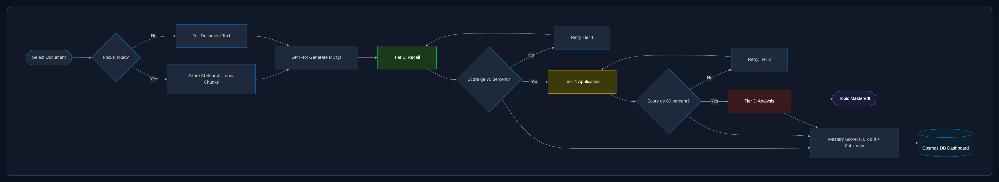
</p>

The quiz system follows **Bloom's Taxonomy** with three tiers:

| Tier | Level | Example Question | Unlock Threshold |
|------|-------|-----------------|-----------------|
| 1 | **Recall** | "What is the formula for force?" | Default |
| 2 | **Application** | "A 5kg object accelerates at 3m/s². Calculate the force." | 70% mastery |
| 3 | **Analysis** | "Compare Newton's 2nd and 3rd laws in collision scenarios." | 80% mastery |

**Mastery scoring:** Exponentially weighted average  
$$M_{new} = 0.6 \times M_{old} + 0.4 \times S_{current}$$

This rewards consistency — a single good score doesn't instantly max out mastery.

### TTS Play/Stop Toggle

<p align="center">
  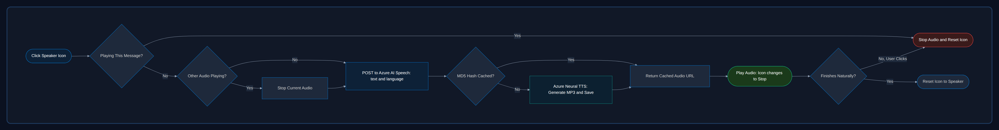
</p>

Both the chat screen and study materials screen support TTS toggling:

- **Tap speaker** → POST `/api/tts` → play audio via `audioplayers` package
- **Tap again while playing** → `audioPlayer.stop()` → icon reverts
- **Audio finishes naturally** → `onPlayerComplete` event resets state
- **Tap speaker on a different message** → stops current, starts new

The backend caches MP3 files by MD5 hash — identical text is never synthesized twice.

### Multilingual & Live Re-translation

<p align="center">
  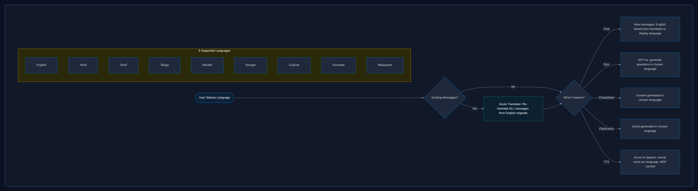
</p>

Every chat message stores two versions:
- `content` — what's displayed (may be translated)
- `originalContent` — always English (best LLM quality)

**On language switch:**
1. If switching to English → instant restore from `originalContent` (zero API calls)
2. If switching to any other language → loop all assistant messages, call `/api/translate` for each
3. A progress indicator shows during bulk translation

This means the user can switch between all 9 languages at any time and every past message updates.

### Progress Reset

<p align="center">
  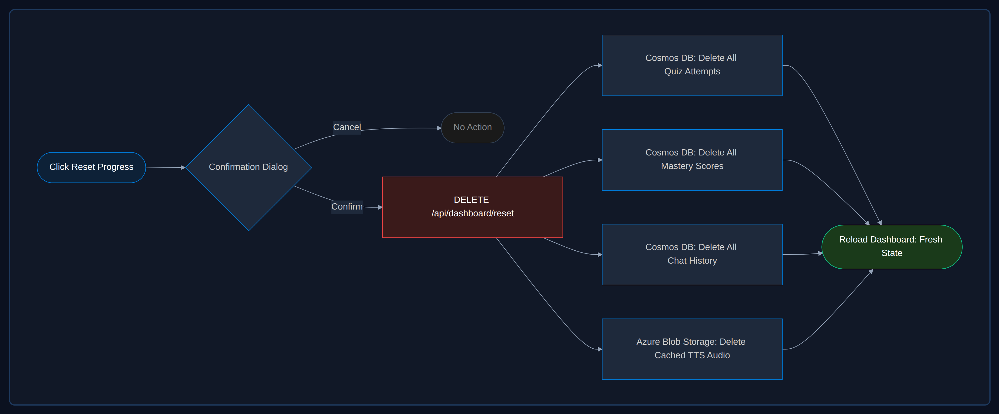
</p>

### Database Schema

<p align="center">
  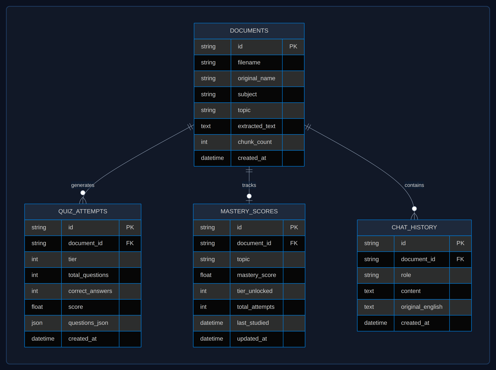
</p>

### User Journey

<p align="center">
  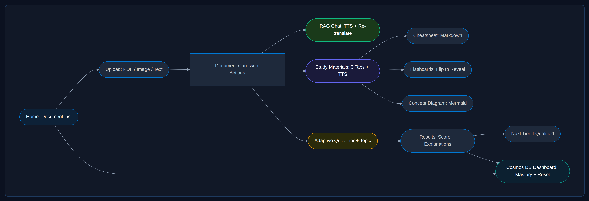
</p>

---